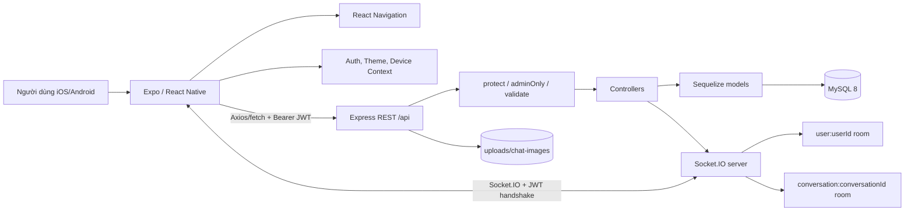
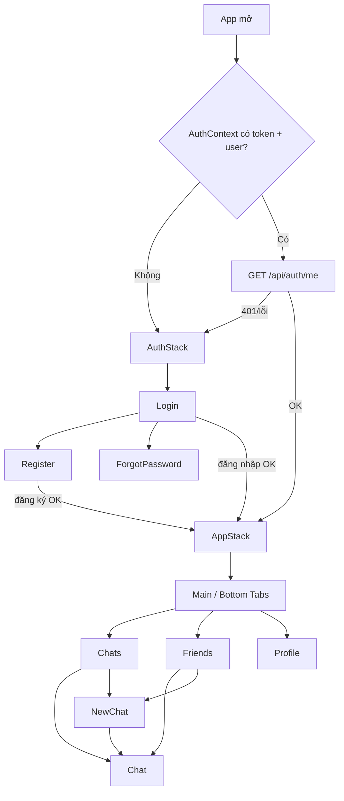
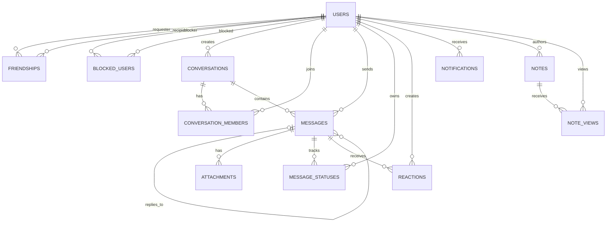

# Tổng quan và bàn giao ứng dụng Proxy

> Cập nhật 2026-09-08: nhánh [Cài đặt và quyền nhóm](features/group-permissions.md) đã có hai màn `GroupSettings`/`GroupPermissions`, policy theo role owner/admin/member, transaction enforcement và realtime refresh. G13 đã local-verified bằng unit/integration/export; native/device QA và live rollout còn pending. Trạng thái tổng thể xem [Plan M9](Plan.md#m9-quyết-định-và-bàn-giao-cho-phiên-ai-tiếp-theo).

> Phạm vi kiểm tra: working tree ngày 19/07/2026. Tài liệu này lấy code đang được import, mount và gọi ở runtime làm nguồn sự thật; tài liệu cũ chỉ được dùng để phát hiện mâu thuẫn. Không có logic ứng dụng nào được sửa trong lần phân tích này.

## 1. Kết luận nhanh

Proxy là ứng dụng nhắn tin mobile full-stack, tên hiển thị trong UI là **Proxy**. Người dùng chính là cá nhân muốn đăng ký tài khoản, kết bạn, tạo chat riêng/nhóm, gửi tin nhắn và đăng “Tin ghi chú” tồn tại 24 giờ. Frontend là React Native chạy bằng Expo; backend là Express; dữ liệu lưu trong MySQL qua Sequelize; REST xử lý nghiệp vụ và Socket.IO đồng bộ một phần thay đổi theo thời gian thực.

Ứng dụng phù hợp nhất với trạng thái **đồ án/demo chức năng có thể chạy**, chưa phải sản phẩm production. Bằng chứng chính: URL production và EAS project ID còn là placeholder, không có migration hay test tự động, CORS mở toàn bộ, file upload lưu local, và luồng quên mật khẩu không xác minh quyền sở hữu email ([`mobile/src/utils/env.js`](../mobile/src/utils/env.js), [`mobile/app.json`](../mobile/app.json), [`backend/server.js`](../backend/server.js), [`backend/src/controllers/auth.controller.js`](../backend/src/controllers/auth.controller.js)).

### Trạng thái tổng thể

| Nhóm | Kết luận | Bằng chứng chính |
|---|---|---|
| Auth | Đăng ký, đăng nhập, khôi phục phiên và đổi mật khẩu dùng được; đăng xuất/401 chỉ hoàn chỉnh phía thiết bị; quên mật khẩu **không an toàn** | [`AuthContext.js`](../mobile/src/store/AuthContext.js), [`auth.router.js`](../backend/src/routers/auth.router.js), [`auth.controller.js`](../backend/src/controllers/auth.controller.js) |
| Hồ sơ | Chỉ xem hồ sơ và đổi mật khẩu trên UI; backend có cập nhật hồ sơ nhưng mobile không gọi | [`ProfileScreen.js`](../mobile/src/screens/ProfileScreen.js), [`user.router.js`](../backend/src/routers/user.router.js) |
| Bạn bè | Tìm, gửi lời mời, xem/chấp nhận lời mời dùng được; từ chối, chặn/bỏ chặn chỉ có backend/API wrapper; không có hủy kết bạn | [`FriendsScreen.js`](../mobile/src/screens/FriendsScreen.js), [`friendship.controller.js`](../backend/src/controllers/friendship.controller.js) |
| Hội thoại | Danh sách, chat riêng, tạo nhóm, ghim/tắt thông báo dùng được; đổi tên/avatar nhóm và rời nhóm chưa có UI; chưa có quản lý thành viên | [`conversation.router.js`](../backend/src/routers/conversation.router.js), [`NewChatScreen.js`](../mobile/src/screens/NewChatScreen.js) |
| Tin nhắn | Text, ảnh, reply, forward, copy, edit, reaction, ẩn local, recall và seen có UI; phân trang, reconnect, delivered và notification còn thiếu/không đồng bộ đủ | [`ChatScreen.js`](../mobile/src/screens/ChatScreen.js), [`message.controller.js`](../backend/src/controllers/message.controller.js) |
| Tin ghi chú | Tạo/xem/xóa/reply, audience và realtime create/delete đã nối; chưa sửa, chưa hiện danh sách viewers, emoji chưa có ô nhập | [`NotesTray.js`](../mobile/src/components/NotesTray.js), [`note.controller.js`](../backend/src/controllers/note.controller.js) |
| Upload | UI/backend chỉ upload ảnh tối đa 10 MB; model/render biết thêm video/file nhưng không có picker/uploader tương ứng | [`upload.router.js`](../backend/src/routers/upload.router.js), [`upload.api.js`](../mobile/src/api/upload.api.js), [`MessageBubble.js`](../mobile/src/components/MessageBubble.js) |
| Commerce/admin | Product/cart/checkout/order không tồn tại trong runtime; admin chỉ có API list/xóa user, không có màn hình | [`backend/src/routers/index.js`](../backend/src/routers/index.js), [`mobile/src/navigation/index.js`](../mobile/src/navigation/index.js) |

## 2. Công nghệ sử dụng

| Tầng | Công nghệ thực tế | Phiên bản khai báo / đã cài |
|---|---|---|
| Mobile | Expo, React Native, React | Expo `~54.0.0` / 54.0.35; RN 0.81.5; React 19.1.0 |
| Navigation | React Navigation native stack + bottom tabs | 6.x |
| State | React Context + reducer/local state; AsyncStorage | AsyncStorage 2.2.0 |
| HTTP | Axios; `fetch` riêng cho multipart upload | Axios 1.18.0 đã cài |
| Realtime | Socket.IO client/server | 4.8.3 |
| UI/motion | Reanimated, Safe Area Context, Expo Vector Icons | Reanimated 4.1.7 |
| Media | Expo Image Picker, Media Library, File System, Clipboard | Theo [`mobile/package.json`](../mobile/package.json) |
| Backend | Node.js, Express, express-validator | Express 4.22.2 đã cài |
| Auth | JWT + bcryptjs | jsonwebtoken 9.0.3; bcryptjs 2.4.3 |
| ORM/DB | Sequelize + mysql2 + MySQL 8 | Sequelize 6.37.8; image `mysql:8.0` |
| Upload/logging | Multer, Morgan | Multer 2.2.0; Morgan 1.11.0 |
| Container | Docker Compose; backend image Node Alpine | `node:18-alpine` |

Nguồn phiên bản: [`backend/package.json`](../backend/package.json), [`mobile/package.json`](../mobile/package.json), lockfiles và [`backend/Dockerfile`](../backend/Dockerfile). Lệnh `npm ls --depth=0` đã thành công trong cả hai package bằng Node 22.20.0/npm 10.9.3 tại máy phân tích; đây là kết quả kiểm tra, không phải cam kết rằng Node 22 là phiên bản bắt buộc.

## 3. Cấu trúc repository và điểm vào

```text
repository/
├─ backend/
│  ├─ server.js                 # entrypoint: DB sync, HTTP, Socket.IO
│  ├─ src/app.js                # Express middleware, static upload, /health, /api
│  ├─ src/config/database.js    # kết nối Sequelize/MySQL
│  ├─ src/routers/              # route được mount
│  ├─ src/controllers/          # nghiệp vụ REST
│  ├─ src/middlewares/          # JWT, role, validation, error
│  ├─ src/models/               # 12 model + associations
│  ├─ src/socket.js             # xác thực socket và rooms
│  └─ uploads/chat-images/      # file upload local
├─ mobile/
│  ├─ App.js                    # entrypoint component/providers
│  ├─ src/navigation/index.js   # auth/app stacks + 3 tabs
│  ├─ src/screens/              # 8 screen, tất cả đã đăng ký
│  ├─ src/components/           # UI dùng chung, actions, notes
│  ├─ src/api/                  # REST/socket clients
│  ├─ src/store/                # Auth/Device/Theme contexts
│  ├─ src/hooks/                # auth export, socket status
│  ├─ src/theme/tokens.js       # design tokens sáng/tối
│  └─ src/utils/                # env, storage, media, local hide, logging
├─ docs/                        # tài liệu; có cả template/ví dụ không phải runtime
└─ docker-compose.yml           # MySQL + backend
```

Điểm đọc quan trọng nhất theo thứ tự: [`mobile/App.js`](../mobile/App.js) → [`mobile/src/navigation/index.js`](../mobile/src/navigation/index.js) → các screen → `mobile/src/api/*`; phía server: [`backend/server.js`](../backend/server.js) → [`backend/src/app.js`](../backend/src/app.js) → [`backend/src/routers/index.js`](../backend/src/routers/index.js) → router/controller → [`backend/src/models/index.js`](../backend/src/models/index.js) và [`backend/src/socket.js`](../backend/src/socket.js).

## 4. Kiến trúc hệ thống



Luồng chuẩn là: UI gọi wrapper API → Axios gắn JWT từ AsyncStorage → Express mount dưới `/api` → middleware → controller → Sequelize/MySQL → JSON quay lại UI. Các controller message/note sau khi ghi DB sẽ emit Socket.IO; client đang ở phòng hội thoại upsert message vào local state. File ảnh được upload trước, sau đó URL file được gửi trong request tạo message ([`client.js`](../mobile/src/api/client.js), [`ChatScreen.js`](../mobile/src/screens/ChatScreen.js), [`message.controller.js`](../backend/src/controllers/message.controller.js)).

## 5. Màn hình và navigation

### Danh sách màn hình

| Route | Screen | Truy cập | Vai trò | Trạng thái |
|---|---|---|---|---|
| `Login` | `LoginScreen` | Chưa đăng nhập | Email/password, sang đăng ký/quên mật khẩu | Đã nối |
| `Register` | `RegisterScreen` | Chưa đăng nhập | Tạo name/email/password | Đã nối |
| `ForgotPassword` | `ForgotPasswordScreen` | Chưa đăng nhập | Đặt mật khẩu mới bằng email | Đã nối nhưng không an toàn |
| `Main/Chats` | `ChatListScreen` | Đã đăng nhập | Notes tray, tìm/list chat, pin/mute | Đã nối |
| `Main/Friends` | `FriendsScreen` | Đã đăng nhập | Danh bạ, lời mời, tìm user | Đã nối |
| `Main/Profile` | `ProfileScreen` | Đã đăng nhập | Hồ sơ, theme, đổi mật khẩu, logout | Đã nối |
| `Chat` | `ChatScreen` | Đã đăng nhập | Hội thoại và message actions | Đã nối |
| `NewChat` | `NewChatScreen` | Đã đăng nhập | Tạo chat riêng/nhóm | Đã nối |

Không có file screen nào ngoài 8 screen trên; vì vậy **không có screen code bị bỏ ngoài navigator** ở working tree hiện tại. Các bottom sheet/modal như Notes, Message Actions, Forward và Image Viewer là component trong screen, không phải navigation route.



Bằng chứng: token quyết định `AuthStack`/`AppStack` trong [`mobile/src/navigation/index.js`](../mobile/src/navigation/index.js); phục hồi phiên và gọi `/auth/me` trong [`mobile/src/store/AuthContext.js`](../mobile/src/store/AuthContext.js).

## 6. Ma trận chức năng

Ký hiệu: **Có** = code tồn tại; **Nối** = người dùng truy cập được từ UI; **Một phần** = có luồng nhưng còn thiếu quan trọng; **Không** = không có trong runtime.

| Nhóm | Chức năng | FE | BE | DB | Navigation/UI | Dùng thực tế | Trạng thái | File chính |
|---|---|---:|---:|---:|---:|---:|---|---|
| Auth | Đăng ký | Có | Có | `users` | Nối | Có | Hoàn chỉnh theo scope demo | `RegisterScreen`, `AuthContext`, `auth.controller` |
| Auth | Đăng nhập/khôi phục phiên | Có | Có | `users` | Nối | Có | Hoàn chỉnh một phần | `LoginScreen`, `AuthContext`, `auth.middleware` |
| Auth | Đăng xuất | Có | Có | `users.is_online` | Nối | Một phần | Mobile không gọi `/auth/logout` | `ProfileScreen`, `AuthContext`, `auth.router` |
| Auth | Quên mật khẩu | Có | Có | `users` | Nối | Có nhưng nguy hiểm | Chưa hoàn chỉnh về bảo mật | `ForgotPasswordScreen`, `auth.controller` |
| Auth | Đổi mật khẩu | Có | Có | `users` | Nối | Có | Hoàn chỉnh theo scope | `ProfileScreen`, `auth.controller` |
| Profile | Xem hồ sơ bản thân | Có | Có | `users` | Nối | Có | Hoàn chỉnh | `ProfileScreen`, `/auth/me` |
| Profile | Sửa name/avatar/phone/username/bio | Không | Có | `users` | Không | Không | Backend-only | `user.router`, `user.controller` |
| Bạn bè | Tìm user | Có | Có | `users` | Nối | Có | Hoàn chỉnh một phần | `FriendsScreen`, `friendship.controller` |
| Bạn bè | Gửi lời mời | Có | Có | `friendships`, `notifications` | Nối | Có | Hoàn chỉnh | cùng file trên |
| Bạn bè | Chấp nhận/từ chối | Có | Có | `friendships` | Chỉ accept | Một phần | Reject không có nút UI | `FriendsScreen`, `social.api`, `friendship.controller` |
| Bạn bè | Chặn/bỏ chặn | Wrapper | Có | `blocked_users` | Không | Không | Backend/API-only | `social.api`, `friendship.router` |
| Bạn bè | Hủy kết bạn | Không | Không | Có thể xóa row nhưng không route | Không | Không | Chưa triển khai | `friendship.router` |
| Hội thoại | List/tìm local | Có | Có | conversation tables | Nối | Có | Hoàn chỉnh một phần | `ChatListScreen`, `conversation.controller` |
| Hội thoại | Chat riêng | Có | Có | conversations/members | Nối | Có | Hoàn chỉnh | `FriendsScreen`, `NewChatScreen` |
| Hội thoại | Tạo nhóm | Có | Có | conversations/members | Nối | Có | Một phần | `NewChatScreen`, `conversation.controller` |
| Hội thoại | Pin/mute | Có | Có | `conversation_members` | Nối | Có | Hoàn chỉnh | `ChatListScreen`, `ChatScreen` |
| Hội thoại | Đổi tên/avatar, rời nhóm | Wrapper | Có | conversation tables | Không | Không | Backend/API-only | `conversation.api`, `conversation.router` |
| Hội thoại | Quản lý thành viên/role | Không | Không | role có trong member | Không | Không | Chưa triển khai | `conversationMember.model` |
| Message | Gửi text | Có | Có | message/status/notification | Nối | Có | Hoàn chỉnh một phần | `ChatScreen`, `message.controller` |
| Message | Gửi ảnh | Có | Có | messages/attachments | Nối | Có | Hoàn chỉnh theo scope ảnh | `ChatScreen`, `upload.router` |
| Message | Reply/copy/forward | Có | Reply/forward dùng send API; copy local | messages | Nối | Có | Hoàn chỉnh một phần | `MessageActionSheet`, `ChatScreen` |
| Message | Edit | Có | Có | `messages.edited` | Nối | Có | Hoàn chỉnh | `message.router`, `ChatScreen` |
| Message | Reaction | Có | Có | `reactions` | Nối | Có | Hoàn chỉnh một phần | `MessageActionSheet`, `message.controller` |
| Message | Xóa cục bộ | Có | Không cần BE | AsyncStorage | Nối | Có trên một thiết bị | Đúng thiết kế local, không phải xóa DB | `hiddenMessages.js`, `ChatScreen` |
| Message | Thu hồi | Có | Có | `messages.recalled` | Nối | Có | Một phần; file/reaction vẫn còn DB | `ChatScreen`, `message.controller` |
| Message | Sent/delivered/seen | Có | Có | `message_statuses` | Nối | Một phần | delivered không emit; seen có emit | `message.controller`, `MessageBubble` |
| Message | Video/file/sticker/voice | Render/schema | Schema nhận type | messages/attachments | Không có picker/upload | Không trọn vẹn | Chưa hoàn chỉnh | `message.model`, `MessageBubble` |
| Notes | Tạo/xem/xóa/feed | Có | Có | notes/note_views | Nối | Có | Hoàn chỉnh một phần | `NotesTray`, `note.controller` |
| Notes | Reply vào DM | Có | Có | conversation/message tables | Nối | Có | Hoàn chỉnh một phần | `NotesTray`, `note.controller` |
| Notes | Viewers | Wrapper/count | Có | `note_views` | Chỉ count | Một phần | Danh sách viewer chưa gọi API | `note.api`, `NoteViewerModal` |
| Notes | Sửa note | Không | Không | `notes` | Không | Không | Chưa triển khai | `note.router` |
| Realtime | Message/update/seen/note | Có | Có | N/A | Nối | Có khi socket/room còn sống | Một phần | `socket.js`, `ChatScreen`, `NotesTray` |
| Presence | Online/offline | Chỉ hiển thị | Cột + login/logout | `users` | Nối một phần | Sai lệch được | Chưa hoàn chỉnh | `auth.controller`, `AuthContext` |
| Typing/push notification | Không | Không/API notification không có | `notifications` chỉ ghi | Không | Không | Chưa triển khai | `notification.model`, routers index |
| Commerce | Product/cart/checkout/order | Không | Không | Chưa xác minh DB thật | Không | Không | Không thuộc runtime | routers/navigation/model indexes |
| Admin | List/xóa user | Không | Có | `users.role` | Không | Không từ app | Backend-only | `user.router`, `adminOnly` |

## 7. Trace end-to-end các chức năng chính

| Chức năng | UI/thao tác + state | API/socket | Backend + middleware | DB, quyền, lỗi chính | Kết luận / file |
|---|---|---|---|---|---|
| Đăng ký | Form local; `AuthContext.register` lưu token/user | `POST /auth/register` | validate → `register` | Tạo `users`, bcrypt hook; 409 email | Dùng được; [`RegisterScreen.js`](../mobile/src/screens/RegisterScreen.js), [`user.model.js`](../backend/src/models/user.model.js) |
| Đăng nhập | Form → context → connect socket | `POST /auth/login` | validate → compare bcrypt → JWT | Sai credential 401; set online | Dùng được; [`LoginScreen.js`](../mobile/src/screens/LoginScreen.js), [`auth.controller.js`](../backend/src/controllers/auth.controller.js) |
| Đăng xuất | Confirm → disconnect + clear AsyncStorage | **Không gọi** `POST /auth/logout` | Route tồn tại, `protect` | DB không được set offline khi logout từ app | Một phần; [`AuthContext.js`](../mobile/src/store/AuthContext.js) |
| Quên mật khẩu | Email + password mới | `POST /auth/forgot-password` | Public validate → update user | Chỉ cần biết email; 404/422 | **Critical**; không được dùng production |
| Cập nhật hồ sơ | Không có form/UI | `PATCH /users/me` chỉ backend | `protect` → `updateProfile` | Owner từ JWT; unique có thể lỗi | Backend-only; [`user.controller.js`](../backend/src/controllers/user.controller.js) |
| Tìm user | Tab search, local result state | `GET /social/users/search?search=` | `protect` → LIKE + limit | Không trả trạng thái quan hệ; lỗi 401/network | Dùng được một phần |
| Gửi lời mời | Nút Kết bạn | `POST /social/requests` | validate/protect; kiểm tra self/block/existing | `friendships`, `notifications`; 403/409 | Dùng được |
| Accept/reject | UI chỉ nút accept | `PATCH /social/requests/:id` | Chỉ recipient được xử lý | status accepted/rejected; 403/404 | Reject chưa nối UI |
| Hủy kết bạn | Không có thao tác | Không endpoint | Không controller | Không có luồng xóa accepted friendship | Chưa triển khai |
| Chặn user | Không có thao tác; wrapper tồn tại | `POST /social/blocks`; `DELETE /social/blocks/:id` | protect; block xóa friendship | `blocked_users`; self/404 | Chưa nối UI |
| Tạo chat riêng | Chạm friend/contact | `POST /conversations/private` | protect; yêu cầu friend, không block | conversation + 2 members; 403/404 | Dùng được |
| Tạo chat nhóm | Chọn ≥2 người, nhập tên | `POST /conversations/groups` | protect/validate; chỉ kiểm tra user tồn tại | Không kiểm tra friend/block; creator admin | Một phần |
| Danh sách chat | Focus/refresh; state local, lọc local | `GET /conversations` | protect → memberships + conversations | Có last message/me; nhiều query | Dùng được, không live-update |
| Gửi text | Composer local; không optimistic message | `POST /conversations/:id/messages`; `message:new` | protect/validate + membership | message/status/notification; empty 400 | Dùng được |
| Gửi ảnh | ImagePicker → upload → tạo message | `POST /upload/chat-image`, rồi send message | protect + Multer MIME/10 MB | file local + attachment; upload orphan nếu bước 2 lỗi | Dùng được một phần |
| Nhận realtime | Screen join room; upsert theo ID | `conversation:join`, `message:new` | Socket JWT + membership join | Không persist client cache | Dùng khi room còn hiệu lực |
| Reply | Long press → context → composer | send message với `reply_to_id` | membership; không kiểm tra reply target cùng conversation | self-FK không constraint; ID sai có thể lỗi/đứt tham chiếu | Một phần |
| Copy | Long press → Clipboard | Không API | Không backend | Chỉ text, lỗi clipboard | Dùng được local |
| Forward | Chọn conversation đích, gửi bản sao | `GET /conversations`, send message | membership ở conversation đích | Không lưu quan hệ “forwarded from”; URL attachment do client gửi | Dùng được một phần |
| Edit | Sender chọn edit, composer tái sử dụng | `PATCH /messages/:id`; `message:updated` | membership + sender-only | content/edited; 403/404 | Dùng được |
| Reaction | Heart/like, optimistic remove | POST/DELETE reaction; `message:updated` | POST kiểm membership; DELETE không kiểm membership | unique message+user | Một phần do DELETE authz thiếu |
| Xóa cục bộ | Confirm → ẩn khỏi list | AsyncStorage key theo user/chat | Không backend | Tối đa 1000 ID/thiết bị; DB không đổi | Dùng đúng phạm vi local |
| Thu hồi | Sender hoặc `isAdmin` chọn recall | `PATCH /messages/:id/recall`; update event | sender hoặc member role admin | content rỗng, recalled=true; attachment/reaction còn | Một phần; private creator cũng là admin |
| Seen | Load chat gọi mark seen | `PATCH /conversations/:id/seen`; `conversation:seen` | membership; update mọi status chưa seen | Quét toàn bộ message IDs | Dùng được nhưng không tối ưu |
| Tin ghi chú | NotesTray + composer/viewer local state | CRUD/feed/reply; `note:created/deleted` | protect; audience/friend/block checks | notes/note_views; 24h | Dùng được một phần |

## 8. Message Actions

Actions mở bằng **nhấn giữ** bubble hoặc attachment. Điều kiện hiển thị được tính trong [`MessageActionSheet.js`](../mobile/src/components/MessageActionSheet.js):

| Action | Điều kiện UI | Quyền backend / lưu trữ | Realtime |
|---|---|---|---|
| Reply | Message đã persist, chưa recall | Send API kiểm membership | `message:new` |
| Forward | Persist, chưa recall, có callback | Send API kiểm membership conversation đích | `message:new` ở đích |
| Copy | Chưa recall và có text | Local clipboard | Không |
| Download / all | Có media hợp lệ, chưa recall | Client tải URL, xin MediaLibrary permission | Không |
| Edit | Persist, chưa recall, chính sender, có text | Backend sender-only | `message:updated` |
| Delete on device | Có server ID, kể cả recalled | Chỉ AsyncStorage local | Không |
| Recall | Persist, chưa recall, sender hoặc UI thấy member `admin` | Backend sender hoặc member role admin | `message:updated` |
| Heart / Like | Persist, chưa recall | POST có membership; DELETE thiếu membership check | `message:updated` |

Trường hợp message chưa có ID server/đang gửi/thất bại bị loại khỏi các action cần persistence bởi `hasServerMessageId`/`isPersistedMessage`. Tuy nhiên ChatScreen hiện không tạo optimistic temp message; nếu gửi text lỗi, nội dung được đưa lại composer, nên nhánh `sending/failed/temp-*` trong bubble gần như không được dùng. Xóa local thật sự không ghi DB; ID được lưu ở key `@lt_mobile_hidden_messages:v1:<user>:<conversation>` ([`messageActions.js`](../mobile/src/utils/messageActions.js), [`hiddenMessages.js`](../mobile/src/utils/hiddenMessages.js)).

## 9. Tin ghi chú

Tin ghi chú được gắn ở đầu danh sách chat qua `ListHeaderComponent={<NotesTray .../>}`. Mỗi tác giả có một note active theo logic ứng dụng; note mới đánh dấu note active cũ là `DELETED`, hết hạn sau 24 giờ, audience là tất cả bạn bè hoặc danh sách custom. Người xem hợp lệ được ghi một row composite key trong `note_views`; reply tạo/mở DM và gửi message text có prefix nội dung note.

| Khả năng | Trạng thái |
|---|---|
| Tạo | Có; text tối đa 60 ký tự; backend còn nhận emoji nhưng composer không có ô emoji riêng |
| Xem feed/chi tiết | Có; chỉ friend, không block, đúng audience, chưa hết hạn |
| Xóa | Có; soft state `DELETED`, owner-only |
| Sửa | Không có route/UI |
| View count | Có trên UI |
| Danh sách viewers | Route + API wrapper có; UI không gọi `getNoteViewersApi` |
| Reply | Có, chuyển thành DM text |
| Realtime | `note:created`, `note:deleted`; không có event view/reply |
| Notification | Reply tạo notification message; note create/delete không tạo row notification/push |

Hạn chế logic: `REPLY_GRACE_MS` đặt 1 giờ nhưng `canViewNote` từ chối ngay khi `expires_at <= now`, nên grace period thực tế không mở rộng được thời gian reply. Feed lọc CUSTOM **sau** khi lấy `limit + 1`, có thể kết thúc pagination sớm nếu nhiều row đầu không thuộc audience. Cooldown tạo note dùng `Map` trong memory, không dùng được nhất quán khi scale nhiều process và không được dọn key ([`note.controller.js`](../backend/src/controllers/note.controller.js)).

## 10. API đang được mount

Tất cả endpoint dưới đây lấy base `/api`, trừ `/health`. `JWT` nghĩa là `protect`; `Admin` nghĩa là thêm `adminOnly`.

| Method | Endpoint | Auth | Input chính → output | Controller / model | Mobile đang gọi |
|---|---|---|---|---|---|
| GET | `/health` | Public | — → status,timestamp | inline `app.js` | Không |
| POST | `/auth/register` | Public | name,email,password,phone?,username? → user,token | `register` / User | Có |
| POST | `/auth/login` | Public | email,password → user,token | `login` / User | Có |
| GET | `/auth/me` | JWT | — → user | `getMe` / User | Có |
| POST | `/auth/logout` | JWT | — → message | `logout` / User | **Không** |
| POST | `/auth/forgot-password` | Public | email,newPassword,confirmPassword → message | `forgotPassword` / User | Có |
| PATCH | `/auth/change-password` | JWT | currentPassword,newPassword → message | `changePassword` / User | Có |
| GET | `/users` | Admin | — → users | `getAll` / User | Không |
| GET | `/users/:id` | JWT | id → user | `getById` / User | Không |
| PATCH | `/users/me` | JWT | name?,avatar?,phone?,username?,bio? → user | `updateProfile` / User | Không |
| DELETE | `/users/:id` | Admin | id → message | `deleteUser` / User | Không |
| GET | `/social/users/search` | JWT | search?,limit? → users | `searchUsers` / User | Có |
| GET | `/social/friends` | JWT | — → users | `getFriends` / Friendship,User | Có |
| GET | `/social/requests` | JWT | — → pending requests | `getFriendRequests` / Friendship | Có |
| POST | `/social/requests` | JWT | friend_id → request | `sendFriendRequest` / Friendship,BlockedUser,Notification | Có |
| PATCH | `/social/requests/:id` | JWT | status accepted/rejected → request | `respondFriendRequest` / Friendship | Có, UI chỉ accepted |
| POST | `/social/blocks` | JWT | blocked_user_id → block | `blockUser` / BlockedUser,Friendship | Không |
| DELETE | `/social/blocks/:id` | JWT | blocked user ID → message | `unblockUser` / BlockedUser | Không |
| GET | `/conversations` | JWT | — → conversations + last_message + me | `listConversations` / Conversation,Member,Message | Có |
| POST | `/conversations/private` | JWT | friend_id → conversation | `createPrivateConversation` | Có |
| POST | `/conversations/groups` | JWT | name,member_ids,avatar? → conversation | `createGroupConversation` | Có |
| GET | `/conversations/:id` | JWT+member | id → conversation | `getConversation` | Có |
| PATCH | `/conversations/:id` | JWT+admin member | name?,avatar? → conversation | `updateConversation` | Không |
| PATCH | `/conversations/:id/settings` | JWT+member | muted?,pinned? → membership | `updateMyConversationSettings` | Có |
| DELETE | `/conversations/:id/members/me` | JWT+member | — → message | `leaveConversation` | Không |
| GET | `/conversations/:conversationId/messages` | JWT+member | page?,limit? → messages,meta | `listMessages` / Message relations | Có, chỉ page 1 |
| POST | `/conversations/:conversationId/messages` | JWT+member | content?,type?,reply_to_id?,attachments? → message | `sendMessage` | Có |
| PATCH | `/conversations/:conversationId/seen` | JWT+member | — → message | `markConversationSeen` / Status,Member | Có |
| PATCH | `/messages/:id` | JWT+member+sender | content → message | `editMessage` / Message | Có |
| PATCH | `/messages/:id/recall` | JWT+member+sender/admin | — → message | `recallMessage` / Message | Có |
| POST | `/messages/:id/reactions` | JWT+member | type → message | `reactToMessage` / Reaction | Có |
| DELETE | `/messages/:id/reactions/me` | JWT | — → message | `removeReaction` / Reaction | Có; thiếu member check |
| POST | `/upload/chat-image` | JWT | multipart `image` → attachment metadata | `uploadChatImage` / filesystem | Có |
| GET | `/notes/me` | JWT | — → note/null | `getMyNote` / Note,View | Có |
| GET | `/notes/feed` | JWT | cursor?,limit? → items,nextCursor | `getFeed` / Note,Friendship,Block | Có |
| POST | `/notes` | JWT | text?,emoji?,audience?,custom IDs? → note | `createNote` | Có |
| GET | `/notes/:id` | JWT+audience | id → note | `getNote` / NoteView | Có |
| DELETE | `/notes/:id` | JWT+owner | id → message | `deleteNote` / Note | Có |
| GET | `/notes/:id/viewers` | JWT+owner | id → viewers | `getViewers` / NoteView,User | **Không** |
| POST | `/notes/:id/reply` | JWT+audience | message → messageId,threadId | `replyToNote` / Conversation,Message | Có |

Không phát hiện frontend gọi endpoint sai hoặc không tồn tại. Ngược lại, các endpoint đánh dấu **Không** chưa có đường vào UI. Global error handler ở [`backend/src/middlewares/error.middleware.js`](../backend/src/middlewares/error.middleware.js); validation trả 422, file quá lớn trả 413. Mount đầy đủ ở [`backend/src/routers/index.js`](../backend/src/routers/index.js).

## 11. Database và ERD

### Danh sách model/bảng

| Bảng | PK; FK/quan hệ | Cột/constraint quan trọng | Chức năng |
|---|---|---|---|
| `users` | `id`; parent của nhiều bảng | email/phone/username unique; role; online; bcrypt hooks | Auth, profile, presence |
| `friendships` | `id`; user_id/friend_id → users | unique có hướng `(user_id,friend_id)`; status enum | Lời mời/bạn bè |
| `blocked_users` | `id`; hai user IDs → users | unique `(user_id,blocked_user_id)` | Chặn |
| `conversations` | `id`; created_by → users | type private/group, name, avatar | Chat riêng/nhóm |
| `conversation_members` | `id`; conversation_id,user_id; last_read logical → message | unique conversation+user; role, muted, pinned | Thành viên/quyền/trạng thái cá nhân |
| `messages` | `id`; conversation_id, sender_id; reply_to_id logical self-ref | type enum, edited, recalled | Nội dung chat |
| `attachments` | `id`; message_id → messages | file_url, MIME, size, thumbnail | Metadata file |
| `message_statuses` | `id`; message_id,user_id | unique message+user; sent/delivered/seen | Delivery/read receipt |
| `reactions` | `id`; message_id,user_id | unique message+user; type string | Cảm xúc |
| `notifications` | `id`; user_id → users | type, content, related_id không FK, read | Ghi notification nội bộ |
| `notes` | `id`; author_id → users | audience/status enums, JSON custom IDs, expires_at; indexes author/status và expiry/status | Tin ghi chú 24h |
| `note_views` | composite `(note_id,viewer_id)` | viewed_at; không timestamps | Lượt xem note |

Định nghĩa: [`backend/src/models`](../backend/src/models), associations: [`backend/src/models/index.js`](../backend/src/models/index.js).



### Độ khớp schema và rủi ro

- Không có thư mục/file migration. Startup luôn gọi `sequelize.sync()`. Mặc định chỉ tạo phần thiếu; khi `DB_SYNC_ALTER=true` sẽ chạy `sync({alter:true})`. Compose cố định `DB_SYNC_ALTER=false` ([`backend/server.js`](../backend/server.js), [`docker-compose.yml`](../docker-compose.yml)).
- Fresh database do Sequelize tạo sẽ theo model/association trên. **Schema và dữ liệu MySQL hiện có chưa xác minh**: Docker daemon không chạy trong lúc kiểm tra, và không có migration history để đối chiếu. Vì vậy không thể xác nhận các bảng commerce cũ còn hay đã xóa.
- `reply_to_id` và `last_read_message_id` cố ý `constraints:false`; `notifications.related_id` và JSON custom audience cũng không có FK. Đây là tham chiếu logic có thể trở thành orphan.
- Friendship chỉ unique theo hướng. Controller tìm cả hai hướng, nhưng race giữa hai request đối nghịch vẫn không được DB ngăn tuyệt đối.
- Không có DB constraint “mỗi author chỉ một ACTIVE note”; transaction giảm rủi ro trong một process nhưng chưa đủ cho concurrency/scale.
- Delete/cascade không được quy định nhất quán ngoài Note→NoteView; xóa user/admin có thể vướng FK hoặc để dữ liệu liên quan tùy schema thực tế.
- Index hiện có cho unique pair và note expiry; chưa thấy index tường minh cho các truy vấn nóng như `messages(conversation_id,created_at)`, `conversation_members(user_id,updated_at)`, `friendships(status,user_id/friend_id)`.

## 12. Socket.IO và realtime

Socket server được tạo sau khi DB sync trong [`backend/server.js`](../backend/server.js). Handshake nhận JWT ở `socket.handshake.auth.token` hoặc Authorization header, verify cùng `JWT_SECRET`, load user, rồi tự join room `user:<id>`. Client gọi `conversation:join`; server chỉ join `conversation:<id>` nếu user là member ([`backend/src/socket.js`](../backend/src/socket.js), [`mobile/src/api/socket.js`](../mobile/src/api/socket.js)).

| Event | Hướng | Nơi emit | Nơi nhận | Nhận xét |
|---|---|---|---|---|
| `conversation:join` | Client→server | `ChatScreen` | `socket.js` | Có membership check |
| `conversation:leave` | Client→server | cleanup ChatScreen | `socket.js` | Rời room |
| `message:new` | Server→conversation room | send message / reply note | `ChatScreen` | Upsert theo ID |
| `message:updated` | Server→conversation room | edit/recall/reaction | `ChatScreen` | Đồng bộ update |
| `conversation:seen` | Server→conversation room | mark seen | `ChatScreen` | Cập nhật outgoing seen |
| `conversation:updated` | Server→user room | send message / reply note | **Không có listener mobile** | Event bị bỏ phí |
| `note:created` | Server→user rooms | create note | `NotesTray` | Reload feed |
| `note:deleted` | Server→user rooms | delete note | `NotesTray` | Reload feed |
| `connect`/`disconnect` | Socket client internal | Socket.IO | `useSocketStatus` | Chỉ bật banner/disable composer |

Các giới hạn quan trọng:

- Reconnect được cấu hình vô hạn với backoff, nhưng ChatScreen chỉ emit `conversation:join` khi effect mount. Sau reconnect, server-side rooms cũ mất và client không rejoin tự động; có thể bỏ lỡ message/update cho đến khi remount screen.
- Chat list không nghe `conversation:updated`, nên khi đang đứng ở tab Chats, message mới không tự đổi preview/unread; dữ liệu chỉ reload khi focus/refresh.
- Delivered được update khi recipient gọi list messages nhưng không emit event; sender chỉ thấy delivered sau lần fetch sau. Seen có event.
- Không có typing event. Online/offline không gắn với socket connect/disconnect; `is_online` có thể stale. Không có dedupe idempotency key cho send REST, nên timeout/retry có thể tạo trùng message.

## 13. Authentication và phân quyền

- JWT ký bằng payload `{id}`, secret `JWT_SECRET`, expiry `JWT_EXPIRES_IN || 7d`; verify trong REST middleware và Socket middleware.
- Password hash bằng bcrypt cost 10 ở hooks `beforeCreate`/`beforeUpdate`; compare qua instance method.
- Token và user JSON lưu trong AsyncStorage keys `@lt_web_token`, `@lt_web_user`. Khi app mở lại, context gọi `/auth/me`; thành công thì refresh user/connect socket, thất bại thì clear storage.
- Không có refresh token, token revocation list hay server session. Logout chỉ là client clear token; token cũ vẫn hợp lệ tới khi hết hạn.
- Role cấp hệ thống: `user`, `admin`. `adminOnly` chỉ bảo vệ `GET /users` và `DELETE /users/:id`; không có UI admin.
- Role hội thoại: `admin`, `member`. Creator cả private lẫn group được gán admin. Vì recall cho phép `member.role === admin`, người tạo **chat riêng** cũng có thể recall message của người kia; UI cũng hiện action này. Đây nhiều khả năng là quyền vượt thiết kế “admin nhóm”.
- Axios interceptor gặp 401 chỉ xóa AsyncStorage, không dispatch `LOGOUT`; `AuthContext.token` trong memory có thể vẫn giữ AppStack cho tới khi reload/explicit logout.
- `POST /auth/forgot-password` public cho phép reset trực tiếp bằng email + mật khẩu mới, không OTP/email token. Đây là lỗ hổng chiếm tài khoản nghiêm trọng nhất.

## 14. State management và lưu trữ client

| State | Dữ liệu | Nguồn sự thật / rủi ro |
|---|---|---|
| `AuthContext` | user, token, loading; login/register/logout/refresh | Server là thật, nhưng user/token cache có thể lệch sau 401/logout |
| `ThemeContext` | light/dark, palette | AsyncStorage key `@lt_web_theme_mode` |
| `DeviceContext` | dimensions, safe-area, device class, layout | Tính lại khi Dimensions đổi |
| `ChatScreen` local | conversation/messages, composer, actions, hidden IDs, socket queue | Không có global chat store/cache; remount fetch lại |
| `ChatListScreen` local | conversations, search, setting sheet | Chỉ refresh focus/pull; không nhận message event |
| `NotesTray` local | my note, feed, friends, modal state | Reload khi event create/delete |
| `hiddenMessages` | danh sách server message IDs bị ẩn | AsyncStorage per user+conversation, tối đa 1000 ID |
| `networkLogger` | tối đa 100 response trong memory | Chỉ `__DEV__`; DebugOverlay luôn mount nhưng production trả null |

State message bị phân tán giữa REST response, socket event và local hidden set. Code có queue socket trước khi hydrate để giảm race; tuy nhiên không có cache/version/last-event cursor, nên mất mạng hoặc reconnect vẫn có thể tạo dữ liệu cũ cho tới lần load lại.

## 15. Upload, file và media

1. `expo-image-picker` chọn duy nhất ảnh; client chặn nếu `fileSize > 10 MB`.
2. `fetch` multipart gửi field `image` tới `/api/upload/chat-image`, timeout 120 giây.
3. Multer lưu `backend/uploads/chat-images/<timestamp>-<random><original-ext>`; chặn >10 MB và chỉ kiểm tra `mimetype.startsWith('image/')`.
4. Backend trả URL tuyệt đối theo request host; `/uploads` được public bằng `express.static`.
5. Mobile gửi metadata này trong request tạo message; attachment row được tạo. Ảnh/video đã có URL có thể tải về Media Library với kiểm tra MIME/signature phía client.

Rủi ro: MIME và extension do client cung cấp, không kiểm tra magic bytes phía server; static upload không cần auth; không có antivirus/quota; upload thành công nhưng tạo message lỗi sẽ để orphan file; recall/xóa local/xóa message không xóa file vật lý; backend tin `attachments[].file_url` từ client. Local volume cũng không phù hợp khi chạy nhiều instance hoặc container production; cần object storage, URL/key nội bộ, content validation và cleanup job.

## 16. UI/UX hiện tại

UI dùng chung đã khá đồng nhất nhờ [`mobile/src/theme/tokens.js`](../mobile/src/theme/tokens.js): palette light/dark, typography, spacing, radius, touch target, motion và layout. Theme được áp vào Navigation và lưu bền. `DeviceContext`/safe-area xử lý nhiều chiều rộng; Android đặt keyboard resize; ChatScreen dùng `useAnimatedKeyboard` + spacer và safe bottom để tránh composer/tin cuối bị bàn phím che.

Các pattern đã có: `AppHeader`, `AuthLayout`, `Button`, `Input`, `SearchBar`, `LoadingState`, `EmptyState`, `ErrorState`, `BottomSheet`, `ConfirmationDialog`, `ToastMessage`, list rows, avatar/online indicator. Chat có cluster bubble, date separator, status, reply preview, media grid, action sheet và feedback lỗi/retry.

Điểm cần cải thiện:

- Chat chỉ tải 50 message đầu và không có “load older”; list luôn scroll cuối khi content size đổi, có thể gây nhảy khi mở media/update.
- Composer bị disable hoàn toàn khi socket disconnected dù REST API có thể vẫn hoạt động; banner không cung cấp retry/manual offline queue.
- Friends search luôn hiện “Kết bạn” vì response không có relationship state; request đã tồn tại sẽ chỉ báo 409.
- Requests chỉ có Accept, không có Reject. Profile không sửa được thông tin dù backend có.
- Note load lỗi bị nuốt và hiển thị tray trống; viewer không hiển thị danh sách viewers.
- Accessibility label đã có ở nhiều action, nhưng chưa thấy automated accessibility test hay font scaling/layout test.
- “Thông báo hội thoại” trong Profile chỉ là mô tả; không có notification center/push settings thật.

### Thay đổi UI/UX chưa commit so với HEAD

Git diff cho thấy working tree hiện có refactor lớn: thay `ChatListItem` bằng `ConversationRow`; thêm tokens/theme và nhiều reusable component; làm lại toàn bộ 8 screen; thêm Notes tray; message action/forward/download/image viewer; connection banner; keyboard/safe-area; loading/error/empty/toast. Các file chính: [`mobile/src/components`](../mobile/src/components), [`mobile/src/screens/ChatScreen.js`](../mobile/src/screens/ChatScreen.js), [`mobile/src/screens/ChatListScreen.js`](../mobile/src/screens/ChatListScreen.js), [`mobile/src/theme/tokens.js`](../mobile/src/theme/tokens.js). Đây là “thay đổi gần đây” theo diff working tree, không phải lịch sử release đã commit.

## 17. Cấu hình môi trường và cách chạy

### Biến môi trường

Backend `.env` đang dùng các key: `PORT`, `NODE_ENV`, `DB_HOST`, `DB_PORT`, `DB_NAME`, `DB_USER`, `DB_PASSWORD`, `JWT_SECRET`, `JWT_EXPIRES_IN`. Không ghi giá trị secret vào tài liệu. `git ls-files` xác nhận cả `backend/.env` và `mobile/.env` đang được track; cần bỏ khỏi Git, thêm file mẫu không chứa secret và rotate mọi credential/JWT secret đã commit. Mobile hỗ trợ `EXPO_PUBLIC_API_URL` và `EXPO_PUBLIC_API_PORT`; cũng đọc `expo.extra.apiBaseUrl/apiHost/apiPort` ([`env.js`](../mobile/src/utils/env.js)).

### Chạy trên máy mới

1. Cài Docker Desktop và Docker Compose; hoặc tự chuẩn bị Node + MySQL.
2. Tạo `backend/.env` với các key trên. Với Compose, DB host/user/password/name bị override theo service config; bắt buộc đặt `JWT_SECRET` mạnh.
3. Từ repository root chạy `docker compose up --build`.
4. Kiểm tra `http://localhost:4500/health`. Trong container backend nghe port 3000; host expose 4500. MySQL container nghe 3306; host chỉ bind `127.0.0.1:3307`.
5. Mở terminal khác: `cd mobile`, `npm install`, `npm run start:clear`.
6. Emulator Android mặc định fallback `10.0.2.2:4500`; iOS simulator dùng `localhost`; Expo Go/thiết bị thật ưu tiên host URI của Metro. Nếu tự resolve sai, đặt `EXPO_PUBLIC_API_URL=http://<LAN-IP>:4500/api`.

Docker backend quy định Node 18; MySQL 8. Mobile dùng Expo SDK 54. Repository không pin phiên bản Node/npm/Docker qua `.nvmrc`, `engines` hoặc toolchain file. Production chưa cấu hình: `https://your-production-api.com/api` và `your-eas-project-id` còn placeholder, không có `eas.json` ([`mobile/src/utils/env.js`](../mobile/src/utils/env.js), [`mobile/app.json`](../mobile/app.json)).

Lỗi cấu hình thường gặp: Docker daemon chưa chạy; port 4500/3307 bận; `JWT_SECRET` thiếu/sai giữa REST/socket; thiết bị thật không truy cập `localhost`; firewall chặn LAN; HTTP local bị platform policy chặn; schema cũ lệch model vì không migration; upload URL chứa host container/localhost không truy cập được từ mobile.

## 18. Kiểm thử và chất lượng

Không tìm thấy unit/integration/E2E test, Jest config, ESLint config, TypeScript config, script `test`, `lint` hay `type-check`. Package chỉ có start/dev/build commands. Vì vậy mọi luồng nghiệp vụ hiện phụ thuộc kiểm thử thủ công.

### Checklist kiểm thử thủ công đề xuất

| Nhóm | Ca kiểm thử tối thiểu |
|---|---|
| Auth | register hợp lệ/trùng email; login đúng/sai; restart phục hồi phiên; token hết hạn; logout; change password; chứng minh forgot-password không được release trước khi có OTP/token |
| Profile | xem field; dark/light persist; đổi password sai/đúng; API update unique conflict |
| Friends | search rỗng/ký tự đặc biệt; send trùng/cross request; accept/reject; block hai chiều; unfriend sau khi bổ sung |
| Conversation | private chỉ friend; block; group 2+ người; duplicate members; pin/mute; admin/member; leave/update |
| Message | empty/4000+ chars; page >1; reply sai ID; edit non-owner; recall sender/admin/member; reaction concurrent; duplicate retry |
| Upload ảnh | jpg/png/gif/heic; fake MIME; >10 MB; timeout; upload xong send lỗi; URL từ thiết bị thật; orphan cleanup |
| Message Actions | message temp/failed/recalled; text-only/media-only; local delete persists restart; forward timeout; private admin recall bug |
| Notes | all/custom audience; block/unfriend; expiry 24h; concurrent create; viewer upsert; pagination CUSTOM; reply tại/qua expiry |
| Socket reconnect | mất Wi-Fi, reconnect, xác nhận rejoin room; event trùng/out-of-order; app background/foreground |
| Offline | banner; send disabled; REST còn/mất; token 401; dữ liệu stale |
| Keyboard | iOS/Android, màn nhỏ/lớn, multiline, reply/edit context, tin cuối không bị che |
| Security | reset account, CORS, JWT secret/expiry, upload polyglot, IDOR mọi endpoint, admin API |

## 19. Technical debt và rủi ro

### Nghiêm trọng

| Vấn đề | Tác động | Bằng chứng |
|---|---|---|
| Forgot password không xác minh email/OTP/token | Biết email là chiếm được tài khoản | [`auth.controller.js`](../backend/src/controllers/auth.controller.js), [`ForgotPasswordScreen.js`](../mobile/src/screens/ForgotPasswordScreen.js) |

### Cao

| Vấn đề | Tác động | Bằng chứng |
|---|---|---|
| Không migrations, schema thật chưa đối chiếu | Drift/mất dữ liệu khi alter, deploy không lặp lại được | `server.js`, không có migration files |
| `.env` chứa credential/JWT key đang được Git track | Secret có thể đã nằm trong clone và lịch sử repository; phải rotate, không chỉ xóa file hiện tại | `git ls-files -- backend/.env mobile/.env` |
| JWT trong AsyncStorage; không refresh/revoke; 401 không cập nhật Context | Token dễ bị lấy hơn SecureStore, phiên UI stale, logout không vô hiệu token | `storage.js`, `client.js`, `AuthContext.js` |
| Logout mobile không gọi backend; presence không theo socket | Online/offline sai kéo dài | `AuthContext.js`, `auth.controller.js`, `socket.js` |
| Reconnect không rejoin conversation room | Bỏ lỡ message/update realtime sau mất mạng | `ChatScreen.js`, `socket.js` |
| CORS REST và Socket `*` | Mở mọi origin trong production | `app.js`, `server.js` |
| Private creator có role admin và recall message người kia | Quyền vượt kỳ vọng sender-only trong DM | `conversation.controller.js`, `message.controller.js` |
| Upload local/public, validation yếu, không cleanup | File giả/orphan, scale và bảo mật kém | `upload.router.js`, `upload.controller.js` |
| Production URL/EAS placeholder | Build release không kết nối/deploy đúng | `env.js`, `app.json` |

### Trung bình

| Vấn đề | Tác động |
|---|---|
| `removeReaction` không kiểm membership | Authz không đồng nhất; user ngoài chat biết ID vẫn gọi được cho reaction của mình |
| Group create không kiểm friendship/block | Có thể thêm bất kỳ user ID tồn tại vào nhóm |
| `updateConversation` không giới hạn type group | Admin của private chat có thể đổi name/avatar qua API |
| Chat list bỏ qua `conversation:updated` | Preview/unread không realtime |
| Delivered không emit; typing/push absent | Trạng thái không đầy đủ |
| Mark seen tải toàn bộ message IDs | Chậm/memory cao với chat dài |
| List conversation dùng include `separate` last message | Nguy cơ nhiều query theo số conversation |
| Message query include nhiều has-many | Count/pagination nặng, row explosion dù có `distinct` |
| UI chỉ page 1/50 messages | Không xem được lịch sử cũ |
| Note feed filter audience sau limit | Có thể mất next cursor/sót note |
| Note cooldown in-memory, Map không cleanup | Không scale, memory tăng theo user |
| Recall không xóa attachment/reaction/file | Dữ liệu vẫn tồn tại dù UI ẩn |
| Notification chỉ ghi DB, không API đọc/push | Bảng tăng nhưng user không dùng được |
| Hardcoded dev DB credentials trong Compose | Chấp nhận cho local nhưng không dùng production |
| Backend package chứa dependency `expo` không dùng | Tăng image/install surface |

### Thấp

- `ChatScreen` lớn khoảng 768 dòng và `MessageBubble` khoảng 309 dòng, khó test/duy trì.
- Logic tạo private conversation/gửi direct message bị lặp giữa conversation và note controllers.
- `getNoteViewersApi`, `updateConversationApi`, `leaveConversationApi`, block/unblock wrappers chưa dùng.
- Các nhánh temp/failed message có nhưng current send flow không tạo optimistic object.
- Không pin toolchain Node/npm và không có health/readiness cho mobile workflow.

## 20. Code có nhưng chưa nối và code cũ

| Phân loại | Thành phần |
|---|---|
| Backend hoạt động, chưa có frontend | `/users` admin, `/users/:id`, `PATCH /users/me`, `DELETE /users/:id`; reject friend request; block/unblock; update conversation; leave conversation; note viewers list |
| Frontend wrapper, chưa có UI caller | `updateConversationApi`, `leaveConversationApi`, `getNoteViewersApi`, `blockUserApi`, `unblockUserApi` |
| Model được dùng để ghi nhưng không có API đọc/UI | `notifications` |
| Schema/render có nhưng luồng tạo chưa có | video/file/sticker/voice messages |
| Chức năng dở | profile edit, reject/block/unblock/unfriend, group member management, note edit/viewers, notification/presence/typing, pagination |
| Code cũ runtime | Không phát hiện screen/component/model/router mồ côi hoàn toàn; `ChatListItem.js` đang bị xóa và đã được `ConversationRow` thay thế |
| Commerce | Không có Product/Cart/Checkout/Order/Admin screen/model/router trong runtime hiện tại |

Các file trong `docs/skills/*` có ví dụ Product/Order/Cart chỉ là template hướng dẫn, không phải code ứng dụng. [`docs/Ghi chú.md`](Ghi%20chú.md) vẫn thảo luận commerce như một phần hệ thống, trong khi [`docs/spec/IMPLEMENT_SUMMARY.md`](spec/IMPLEMENT_SUMMARY.md) nói đã gỡ/drop và [`README.md`](../README.md) lại nói bảng cũ “nếu còn” chưa bị drop tự động. Các tuyên bố DB này mâu thuẫn nhau và không thể xác minh khi DB không chạy; kết luận runtime phải theo routers/models/navigation hiện tại: **không có commerce**.

## 21. Nội dung ngắn cho slide báo cáo

| Slide | Nội dung trình bày | File minh chứng | Ảnh/demo nên dùng |
|---|---|---|---|
| 1. Bài toán | Kết nối bạn bè và nhắn tin mobile realtime | README, navigation | Login + chat list |
| 2. Mục tiêu | Auth, social graph, chat riêng/nhóm, notes 24h | feature matrix | Luồng end-to-end |
| 3. Người dùng | Cá nhân dùng app iOS/Android; admin API chưa có UI | user model | Profile |
| 4. Chức năng | Auth, friends, conversations, messages, notes, theme | screens/components | Montage 3 tabs |
| 5. Đang phát triển | Profile edit, block/reject, group management, notifications, pagination | API-unused table | Nêu roadmap |
| 6. Kiến trúc | Expo → REST/Socket → Express → Sequelize → MySQL | app/server/models/socket | Dùng sơ đồ kiến trúc mục 4 |
| 7. ERD | 12 bảng runtime | models/index | Dùng ERD mục 11 |
| 8. Data flow | JWT REST, controller, ORM, response; socket event | client/app/controllers | Demo gửi text |
| 9. Realtime | rooms user/conversation, new/update/seen/note | socket.js, ChatScreen | Hai thiết bị chat |
| 10. Message Actions | reply, forward, copy, edit, reaction, local delete, recall, download | MessageActionSheet | Nhấn giữ bubble |
| 11. Tin ghi chú | 24h, audience, viewer, reply DM | NotesTray/note controller | Tạo custom note + reply |
| 12. UI/UX | Token sáng/tối, reusable states, safe area/keyboard | tokens/components | Toggle theme, keyboard |
| 13. Kết quả | 8/8 screen đã nối; 39 API `/api`; 12 models | navigation/routers/models | Demo happy path |
| 14. Hạn chế | Reset password, migration/test, reconnect, upload local | debt section | Không demo luồng nguy hiểm |
| 15. Hướng đi | Bảo mật auth, migrations/tests, reconnect, cloud storage, missing UI | roadmap dưới đây | Timeline ưu tiên |

### Thứ tự phát triển tiếp

1. Khóa/remove forgot-password hiện tại; triển khai reset token/OTP có expiry và rate limit.
2. Thêm migrations + backup/restore, index truy vấn nóng và CI test/lint.
3. Sửa auth lifecycle/401/logout/presence; rejoin rooms và sync chat list sau reconnect.
4. Siết quyền private/group, reaction, group membership và CORS.
5. Chuyển upload sang object storage, validate magic bytes, cleanup orphan.
6. Nối các UI còn thiếu: profile, reject/block/unblock/unfriend, group management, viewers/notification.
7. Thêm message cursor pagination, offline/idempotency và E2E multi-device.

## 22. Danh sách file quan trọng cần đọc

| Mục đích | File |
|---|---|
| Mobile bootstrap/providers | [`mobile/App.js`](../mobile/App.js) |
| Navigation/source of reachable screens | [`mobile/src/navigation/index.js`](../mobile/src/navigation/index.js) |
| Auth/session | [`mobile/src/store/AuthContext.js`](../mobile/src/store/AuthContext.js), [`backend/src/controllers/auth.controller.js`](../backend/src/controllers/auth.controller.js) |
| HTTP/env/storage | [`mobile/src/api/client.js`](../mobile/src/api/client.js), [`mobile/src/utils/env.js`](../mobile/src/utils/env.js), [`mobile/src/utils/storage.js`](../mobile/src/utils/storage.js) |
| Chat UX/state | [`mobile/src/screens/ChatScreen.js`](../mobile/src/screens/ChatScreen.js), [`mobile/src/components/MessageActionSheet.js`](../mobile/src/components/MessageActionSheet.js) |
| Notes UI | [`mobile/src/components/NotesTray.js`](../mobile/src/components/NotesTray.js) |
| Backend bootstrap/mount | [`backend/server.js`](../backend/server.js), [`backend/src/app.js`](../backend/src/app.js), [`backend/src/routers/index.js`](../backend/src/routers/index.js) |
| Message/conversation logic | [`backend/src/controllers/message.controller.js`](../backend/src/controllers/message.controller.js), [`backend/src/controllers/conversation.controller.js`](../backend/src/controllers/conversation.controller.js) |
| Notes logic | [`backend/src/controllers/note.controller.js`](../backend/src/controllers/note.controller.js) |
| DB graph | [`backend/src/models/index.js`](../backend/src/models/index.js) |
| Socket rooms/events | [`backend/src/socket.js`](../backend/src/socket.js), [`mobile/src/api/socket.js`](../mobile/src/api/socket.js) |
| Runtime/deploy config | [`docker-compose.yml`](../docker-compose.yml), [`backend/Dockerfile`](../backend/Dockerfile), [`mobile/app.json`](../mobile/app.json) |

## 23. Tự kiểm tra độ bao phủ

- 8 file screen đã được liệt kê và đều xuất hiện trong navigator.
- 7 router domain đã mount; bảng API có 39 endpoint dưới `/api` cộng `/health`.
- 12 model runtime đều có trong bảng database và ERD.
- Mọi event tìm thấy trong backend/mobile đều có trong bảng Socket.IO, kể cả `conversation:updated` không có listener.
- Product/cart/checkout/order đã được kiểm tra ở source runtime và không tồn tại; chỉ còn nhắc trong docs/template.
- Các kết luận không kiểm tra được với DB thật đã được ghi rõ **chưa xác minh**.
- Không có chức năng nào được đánh dấu hoàn chỉnh chỉ dựa vào tên file; trạng thái dựa trên đường gọi UI → API/socket → controller → model.
